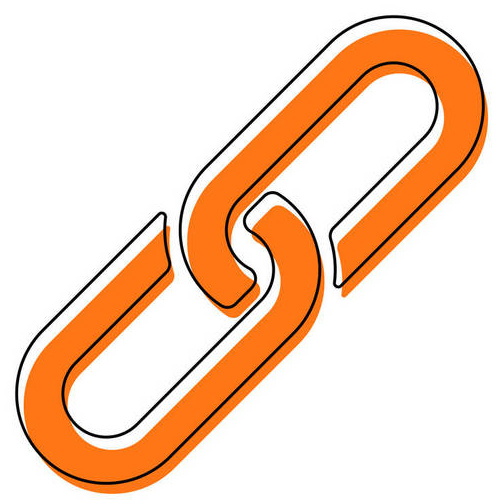

  

     

## 说明

作为浏览器内核和移动端的链接桥，通过 WS 链接提供实时活跃数据服务。

## 约定

- 安全，WS本地传递，数据安全。
- 可靠，断线重连机制，保证数据不丢失。
- 高隔离性，使用类的方式封装，保证全局的高隔离性。
- 高易用性，支持 AMD、UMD、RequireJS、CommonJS。覆盖业界主流开发模式。
- 多环境支持，支持不仅限于 Vue、React、Angular、原生 H5 等。具体写法参照[样例](https://github1s.com/zhaitianye/keyboard-link/blob/HEAD/demo)。
- 主流的开发模式，此 SDK 基于 TypeScript 开发，使用 Rollup 打包。
- 所有 SDK 通讯均为 JSON， 包括数据和错误。
- 支持异步，async await 形式。
- MD 标准文档。
- 完整的 [更新说明](../update/update.md)。
